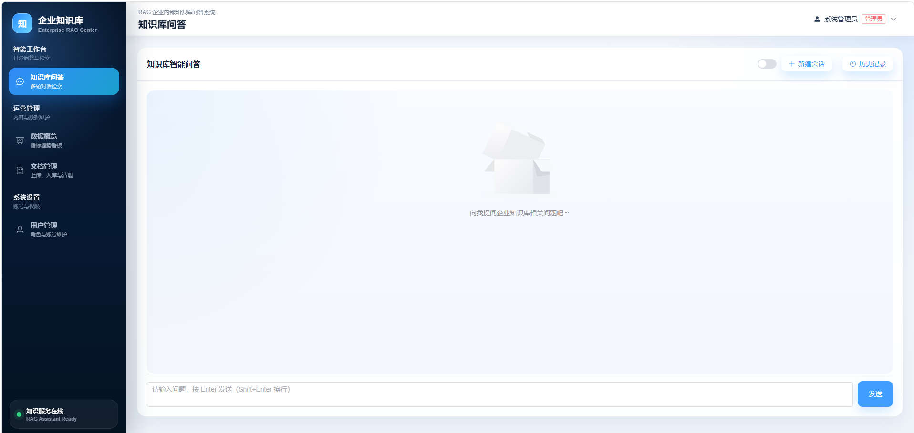

# RAG 企业内部知识库问答 Agent 系统

基于 **LangChain 1.x `create_agent` + 通义千问(Qwen) + Chroma** 的企业内部知识库智能问答 **Agent** 系统。Agent 自主决定调用「知识库检索」或「Tavily 联网搜索」工具，并具备多轮对话记忆；检索侧实现了 **查询改写 → 混合检索(向量 + BM25) → RRF 融合 → Rerank 重排** 的多阶段优化链路。提供管理员/普通用户两种角色、会话级问答历史与后台数据统计图表。

> 一句话定位：一个面向企业内部知识库的 **Agentic RAG** 系统，覆盖「文档解析入库 → 多阶段检索优化 → Agent 工具编排 → 多轮记忆」完整链路。


## 技术栈

| 层 | 技术 |
| --- | --- |
| 后端 | Python 3.12 + FastAPI + SQLAlchemy 2.x + PyMySQL |
| 前端 | Vue3 + Vite + Element Plus + Pinia + Vue Router + ECharts |
| 数据库 | MySQL 8.0（库名 `db_enterprise_ga`） |
| 向量库 | Chroma（本地持久化） |
| 主模型 | 通义千问 `qwen-plus`（DashScope OpenAI 兼容端点） |
| 嵌入模型 | 通义千问 `text-embedding-v4` |
| 改写小模型 | DeepSeek `deepseek-chat`（按需触发的查询改写） |
| Agent | `langchain.agents.create_agent`（知识库检索工具 + Tavily 联网工具） |
| Agent 中间件 | LangChain Agent Middleware（`before_model` 钩子做查询改写） |
| 多轮记忆 | LangGraph `SqliteSaver` checkpointer（按 用户+会话 隔离） |
| 文档解析 | MinerU（PDF/DOCX 高精度解析）+ pypdf/python-docx 本地兜底 |
| 检索优化 | 向量检索 + BM25(jieba 分词) 混合 → RRF 融合 → DashScope Rerank |
| 联网搜索 | Tavily（`langchain-tavily`） |
| 鉴权 | JWT + 密码 MD5 加密 |
| 环境管理 | uv |

## 目录结构

```
RAG-QA/
├── server/                 # 后端
│   ├── main.py             # FastAPI 入口
│   ├── core/               # 配置、数据库、安全、鉴权依赖
│   ├── models/             # SQLAlchemy ORM 模型
│   ├── schemas/            # Pydantic 模型
│   ├── services/           # LLM / RAG / Agent 服务
│   │   ├── llm.py          # 主模型 / 嵌入 / 改写小模型 工厂
│   │   ├── rag_service.py  # 解析入库 + 混合检索 + RRF + Rerank
│   │   ├── middleware.py   # Agent 中间件：按需查询改写
│   │   └── agent_service.py# create_agent 编排 + SqliteSaver 记忆
│   ├── api/                # 路由：auth/users/documents/chat/stats
│   ├── sql/init.sql        # 建表 DDL + 测试数据
│   ├── chroma_db/          # Chroma 向量库（运行时生成）
│   └── uploads/            # 上传文件（运行时生成）
├── client/                 # 前端 Vue3 项目
├── scripts/                # 工具脚本
│   ├── gen_test_docs.py    # 生成 12 份测试知识库文档
│   └── eval_retrieval.py   # 检索效果评测（Hit@k / MRR）
├── test_docs/              # 生成的测试文档（docx/txt/pdf/md 各 3 份）
├── .env                    # 环境变量（API Key、数据库、JWT 等）
├── pyproject.toml          # 后端依赖（uv）
└── README.md
```

## 环境要求

- Python 3.12（由 uv 托管的独立 CPython，详见下方说明）
- Node.js 18+
- MySQL 8.0（账号 `root`，密码 `123456`，端口 `3306`）
- uv（Python 包与环境管理工具）

> 重要：本项目要求使用 **uv 托管的独立 CPython**（`pyproject.toml` 中已配置 `python-preference = "only-managed"`）。若使用 Anaconda 自带的 Python 创建虚拟环境，`chromadb` 与 `onnxruntime` 的原生库会因 DLL 冲突而崩溃（Windows 下表现为退出码 `-1073741819`）。

## 快速开始

### 1. 初始化数据库

在 MySQL 中执行建表与测试数据脚本（注意使用 utf8mb4 字符集）：

```bash
mysql -uroot -p123456 --default-character-set=utf8mb4 -e "source server/sql/init.sql"
```

### 2. 启动后端

```bash
# 安装 uv 托管的 Python（首次）
uv python install 3.12

# 同步依赖（uv 会自动创建 .venv）
uv sync

# 启动服务
uv run uvicorn server.main:app --reload --port 8000
```

后端接口文档：<http://localhost:8000/docs>

### 3. 启动前端

```bash
cd client
npm install
npm run dev
```

前端访问地址：<http://localhost:5173>（已配置 `/api` 代理到后端 8000 端口）

> Windows 提示：若 `npm install` 报 `ERR_INVALID_ARG_TYPE` 且环境变量 `ComSpec` 为空，请先执行：
>
> ```powershell
> $env:ComSpec = "C:\Windows\System32\cmd.exe"
> ```

## 默认账号

| 用户名 | 密码 | 角色 |
| --- | --- | --- |
| admin | 123456 | 管理员 |
| user01 | 123456 | 普通用户 |

密码均使用 MD5 加密存储（`123456` → `e10adc3949ba59abbe56e057f20f883e`）。

## 功能说明

### 管理员

- **数据概览**：用户数、文档数、问答数、向量切片数等统计卡片；近 7 天问答趋势折线图、文档类型饼图、用户角色饼图。
- **文档管理**：上传 PDF/TXT/Markdown/DOCX 文档，自动解析、切片并写入 Chroma 向量库；支持删除（同步清理向量）。
- **用户管理**：新增、编辑、删除用户，重置密码。
- **知识库问答**：与普通用户一致。

### 普通用户

- **知识库问答**：基于企业知识库进行检索增强问答；Agent 自主决定是否检索/联网；可开启「联网搜索」调用 Tavily 获取最新网络信息；展示回答来源；支持**多轮对话记忆**与**会话级历史**（按会话聚合，可新建会话、回看历史会话）。

## RAG 工作流程

**入库（离线）**

管理员上传文档 → 解析（PDF/DOCX 走 **MinerU** 高精度解析，失败回退 pypdf/python-docx；TXT/MD 直接读取）→ `RecursiveCharacterTextSplitter`（中文分隔符，`chunk_size=500/overlap=100`）切片 → 附加 `doc_id/title/chunk_index` 元数据 → Qwen 嵌入 → 写入 Chroma，同时失效化 BM25 索引缓存。

**问答（在线）**

1. 用户提问携带 `session_id` → Agent 中间件（`before_model`）按启发式判断是否需要改写：仅在**多轮追问、过短或含指代词**时，调用便宜的 **DeepSeek** 把问题改写为独立、完整的检索式（普通提问直接放行，不增加延迟）。
2. `create_agent` 驱动的 Agent 自主决定是否调用工具：
   - **知识库检索**：向量检索 + **BM25 关键词检索（jieba 中文分词）** 双路召回 → **RRF 融合** → **DashScope Rerank 重排** → 取 Top-K。
   - **联网搜索**：Tavily 获取最新网络信息。
3. Qwen 综合作答 → 返回答案与来源 → **LangGraph `SqliteSaver`** 按 `用户+会话` 持久化对话状态，支撑多轮记忆 → 按会话记录问答历史。

> 检索链路各阶段均带 `try/except` 优雅降级：任一外部依赖（Rerank/BM25/改写模型）异常时自动回退到基础向量检索，保证可用性。

## 项目亮点（Agent / RAG 技术实现）

面向 Agent 开发岗位，本项目的核心技术实现可概括为：

- **Agentic RAG 编排**：基于 LangChain 1.x `create_agent` 构建工具型 Agent，将「知识库检索」「联网搜索」封装为工具，由 LLM 自主决策调用时机，而非写死的 RAG 流水线。
- **多阶段检索优化**：在朴素向量检索之上，叠加 **BM25 关键词召回 + RRF 融合 + Rerank 重排**，对"专有名词 / 编号 / 缩写"类查询尤为有效。
- **基于 Agent Middleware 的按需查询改写**：用 `before_model` 钩子接入 DeepSeek 小模型做查询改写，并设计**启发式触发**（多轮/短问/指代才改写），在保留多轮指代消解能力的同时，避免给普通提问增加 LLM 调用延迟。
- **多轮对话记忆**：用 LangGraph `SqliteSaver` checkpointer 实现短期记忆，`thread_id = 用户ID + 会话ID` 保证不同用户、不同会话的上下文隔离。
- **高保真文档解析**：集成 MinerU 的 LangChain 支持库处理 PDF/DOCX（OCR、表格、公式），并保留本地解析器作为兜底。
- **检索评测体系**：`scripts/eval_retrieval.py` 用 Hit@1 / Hit@3 / MRR 对比"仅向量"与"混合+RRF+Rerank"两套检索方案，按"原始集 / 易混淆集 / 刁钻集（硬负样本）"分组量化、可复跑；配套 `scripts/gen_eval_docs.py` 生成"同族高相似"对抗语料（如 IDC-BJ-01/SH-02/GZ-03 三份结构雷同仅编号不同的运维手册）。**在专门构造的硬负样本评测集上，混合检索 + Rerank 将 Hit@1 从 58.3% 提升至 100%（相对提升约 71.5%），MRR 从 0.778 提升至 1.0（相对提升约 28.6%）。**
- **工程化**：FastAPI + SQLAlchemy 后端，JWT + RBAC 鉴权，Vue3 + Element Plus 前端与 ECharts 看板，uv 管理 Python 环境。

> 检索评测说明（实测）：在 24 篇文档、含 4 组高度相似文档（数据中心运维手册 / 微服务接口文档 / 产品版本发布说明 / 采购订单）的评测集上，按难度分三组：
>
> | 评测集 | 说明 | Baseline Hit@1 | Optimized Hit@1 | Hit@1 相对提升 |
> | --- | --- | --- | --- | --- |
> | 原始集 | test_docs，主题互斥 | 91.7% | 100% | +9.1%（噪声级） |
> | 易混淆集 | 同族文档，问题含唯一编号 | 91.7% | 100% | +9.1%（噪声级） |
> | **刁钻集** | **硬负样本：关键词在干扰文档中也出现** | **58.3%** | **100%** | **+71.5%** |
>
> 关键结论：
> - 查询**含唯一编号**（如直接问 `IDC-BJ-01`）时，强 embedding（Qwen `text-embedding-v4`）已能精确命中，纯向量即接近满分，优化空间有限。
> - 查询命中**硬负样本**（如"收货人是李雷的采购订单"——李雷同时是另一文档的机房主管；"库存不足导致无法下单的错误码"——"库存不足"在两个服务文档中同词不同义）时，纯向量被表面词面相似带偏（正确文档跌到第 2~3 名），**混合检索的 BM25 精确召回 + Rerank 的上下文重排可稳定纠回 Top-1**。
> - 收益与"查询是否触发族内/同名/同词混淆"强相关：越是真实业务中"专名多、易混淆、长文档"的场景，优化收益越显著。评测脚本与对抗语料生成脚本均可直接复用于更大规模语料的对比测量。

## 环境变量（.env）

关键配置项：

```
DASHSCOPE_API_KEY=...           # 通义千问 / 嵌入 / Rerank API Key
DASHSCOPE_BASE_URL=...          # DashScope OpenAI 兼容端点
DEEPSEEK_API_KEY=...            # 查询改写小模型 DeepSeek API Key（可空，留空则跳过改写）
MINERU_TOKEN=...                # MinerU 文档解析 Token（可空，留空则用本地解析器）
TAVILY_API_KEY=...              # Tavily 联网搜索 API Key
MYSQL_HOST / MYSQL_PORT / MYSQL_USER / MYSQL_PASSWORD / MYSQL_DB
JWT_SECRET_KEY / JWT_ALGORITHM / JWT_EXPIRE_MINUTES
LLM_MODEL=qwen-plus             # 主 Agent 模型
EMBEDDING_MODEL=text-embedding-v4
QUERY_REWRITE_MODEL=deepseek-chat   # 查询改写模型
RERANK_MODEL=gte-rerank-v2          # 重排模型
```

## 主要接口

| 方法 | 路径 | 说明 | 权限 |
| --- | --- | --- | --- |
| POST | `/api/auth/login` | 登录 | 公开 |
| GET | `/api/auth/me` | 当前用户 | 登录 |
| GET/POST/PUT/DELETE | `/api/users` | 用户管理 | 管理员 |
| GET | `/api/documents` | 文档列表 | 管理员 |
| POST | `/api/documents/upload` | 上传文档入库 | 管理员 |
| DELETE | `/api/documents/{id}` | 删除文档 | 管理员 |
| POST | `/api/chat/ask` | 知识库问答（携带 `session_id` 维持多轮） | 登录 |
| GET | `/api/chat/sessions` | 我的会话列表（按会话聚合，含标题与最后时间） | 登录 |
| GET | `/api/chat/sessions/{session_id}` | 某个会话的全部问答消息 | 登录 |
| GET | `/api/stats/overview` | 首页统计 | 管理员 |
